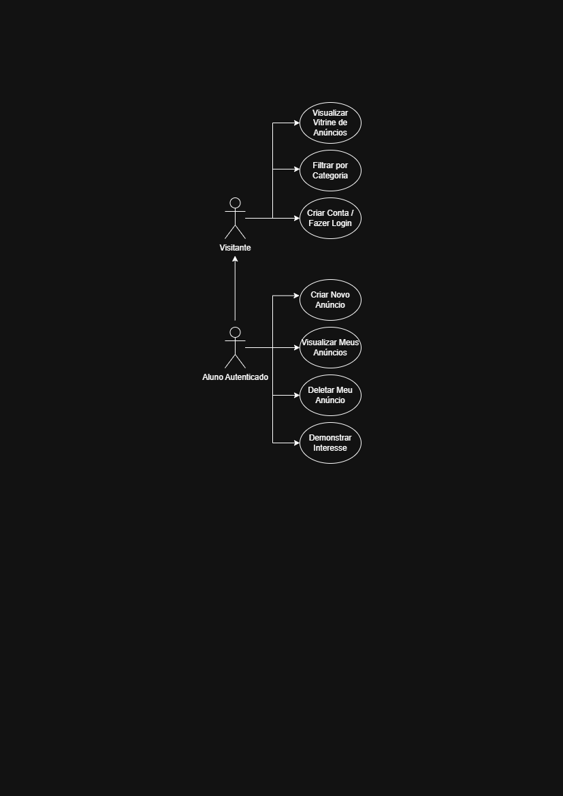
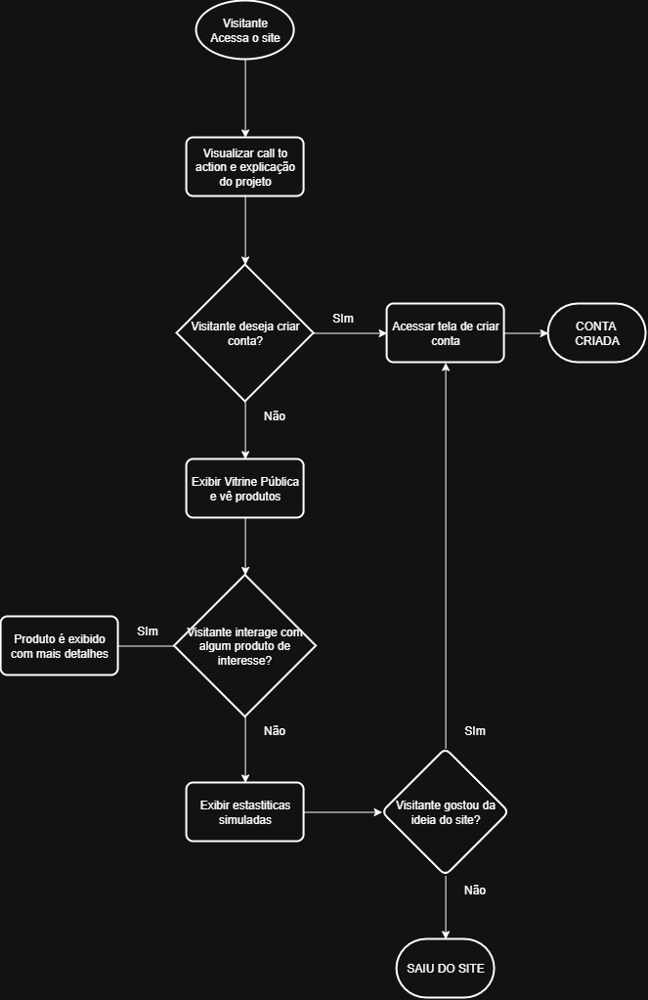
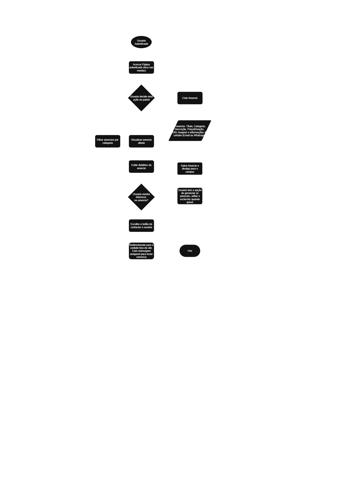
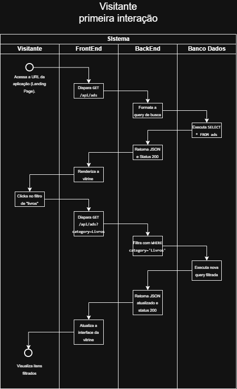
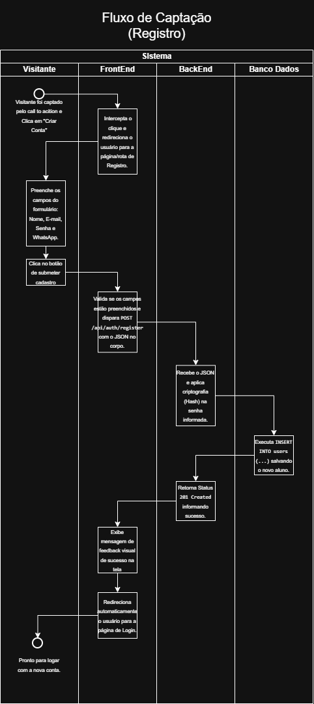
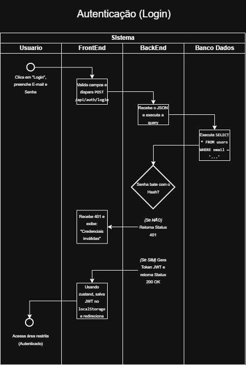
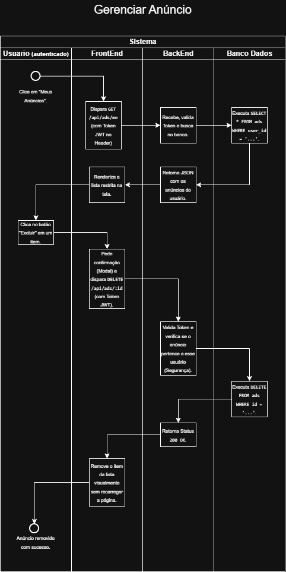
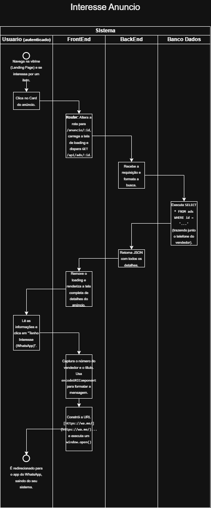

# 🎓 Desapego Universitário

> Marketplace acadêmico em formato de Progressive Web App (PWA) para facilitar a doação, troca e venda de materiais universitários entre estudantes da UNIFOR.


## 🌐 Links de Produção (Deploy)

Acesse a aplicação rodando em produção através dos links abaixo:

* **📱 Frontend (PWA - Vercel):** [https://desapego-universitario-rose.vercel.app](https://desapego-universitario-rose.vercel.app/)
* **⚙️ Backend (API RESTful - Render):** [https://desapego-universitario-api.onrender.com](https://desapego-universitario-api.onrender.com/)

> **Nota:** Como o backend está hospedado no plano gratuito do Render, a primeira requisição pode demorar alguns segundos para "acordar" o servidor.

## Como Executar o Projeto Localmente

Siga os passos abaixo para rodar a aplicação completa (Frontend e Backend) no seu ambiente de desenvolvimento.

### Pré-requisitos
* [Node.js](https://nodejs.org/) (v18 ou superior)
* [Git](https://git-scm.com/)
* Gerenciador de pacotes (`npm` ou `yarn`)

### Passo 1: Clonar o repositório

Abra o seu terminal e execute:

```bash
git clone [https://github.com/Fafazs/desapego-universitario.git](https://github.com/Fafazs/desapego-universitario.git)
cd desapego-universitario
```

### Passo 2: Configurar e Rodar o Backend (API Node.js)

Abra o terminal na pasta do backend, instale as dependências e configure as variáveis de ambiente:

```bash
cd backend
npm install
```

Crie um arquivo chamado `.env` na raiz da pasta `backend` com as seguintes credenciais (solicite as chaves do banco de dados ao desenvolvedor ou use o seu próprio projeto Supabase):

```env
PORT=3000
JWT_SECRET=sua_chave_secreta_jwt_aqui
SUPABASE_URL=[https://sua-url-do-supabase.supabase.co](https://sua-url-do-supabase.supabase.co)
SUPABASE_SERVICE_KEY=sua_service_role_key_aqui
```

Inicie o servidor de desenvolvimento:

```bash
npm run dev
```
O backend estará rodando em `http://localhost:3000`.

### Passo 3: Configurar e Rodar o Frontend (React + Vite)

Abra uma nova aba no terminal, navegue até a pasta do frontend e instale as dependências:

```bash
cd frontend
npm install
```
Inicie o servidor do React/Vite:

```bash
npm run dev
```
O frontend estará acessível em `http://localhost:5173`.
---

## 📑 Índice

- [1. Introdução](#1-introdução)
- [2. Visão Geral do Produto / Serviço](#2-visão-geral-do-produto--serviço)
  - [Objetivo](#21-objetivo)
  - [Justificativa](#22-justificativa)
  - [Sistemas Relacionados e Escopo Negativo](#23-sistemas-relacionados-e-escopo-negativo)
  - [Premissas e Restrições](#24-premissas-e-restrições)
  - [Stakeholders e Objetivos](#25-stakeholders-e-objetivos)
  - [Sistemas Semelhantes no Mercado](#26-sistemas-semelhantes-no-mercado)
- [3. Requisitos Funcionais](#3-requisitos-funcionais)
- [4. Requisitos Não Funcionais](#4-requisitos-não-funcionais)
- [5. Engenharia de Software (Fluxogramas)](#5-engenharia-de-software-fluxogramas)
- [6. Modelagem do Banco de Dados](#6-modelagem-do-banco-de-dados)
- [7. Conclusão](#7-conclusão)
- [8. Diário de Bordo da IA](#8-diário-de-bordo-da-ia)

---

## 1. Introdução

O presente documento visa formalizar a especificação de requisitos para o projeto **"Desapego Universitário"**, uma plataforma digital (Progressive Web App - PWA) que busca solucionar a desconexão e o desperdício de materiais acadêmicos na Universidade de Fortaleza (UNIFOR). O problema central a ser resolvido é a dependência de grupos genéricos em redes sociais, que sofrem com poluição visual e falta de segurança, dificultando o repasse sustentável e organizado de itens entre alunos veteranos e ingressantes.

---

## 2. Visão Geral do Produto / Serviço

O projeto consiste em um marketplace de nicho focado em economia circular, desenvolvido para facilitar a doação, troca e venda de materiais de utilidade universitária. O sistema atua como uma vitrine de conexões e intenções, otimizando o encontro entre quem possui materiais ociosos e quem necessita deles.

### 2.1 Objetivo
Desenvolver e implementar uma plataforma digital exclusiva e segmentada para o campus, que permita aos estudantes cadastrar anúncios rapidamente e aos visitantes filtrar itens por categorias acadêmicas específicas, facilitando o contato direto entre as partes para a negociação presencial no campus.

### 2.2 Justificativa
A implementação do projeto é justificada pela necessidade de promover a sustentabilidade, o senso de comunidade e o apoio mútuo entre os alunos.
* ♻️ **Economia Circular:** Redução drástica do desperdício de materiais em bom estado (livros, calculadoras, jalecos).
* 🤝 **Inclusão Acadêmica:** Diminuição das barreiras financeiras para calouros ao facilitar o acesso a materiais mais baratos ou gratuitos (doações).
* 🎯 **Organização e Foco:** Eliminação da poluição visual encontrada em classificados amplos, focando exclusivamente nas necessidades reais do estudante universitário.

### 2.3 Sistemas Relacionados e Escopo Negativo

O produto atuará como um facilitador ("matchmaker") e precisará interagir com ferramentas externas de comunicação para a finalização das negociações.

#### Sistemas Relacionados
* **WhatsApp / Navegador:** O sistema gerará links dinâmicos (`wa.me`) integrando-se nativamente com o aplicativo de mensagens do usuário para que o acordo final seja realizado fora da plataforma.

#### 🚫 Escopo Negativo (O que o projeto NÃO fará)
* **Sistema Financeiro:** Não haverá carrinho de compras, cálculo de frete, pagamento via Pix/Cartão, ou emissão de nota fiscal.
* **Chat Interno:** O sistema não gerenciará troca de mensagens em tempo real (WebSockets) entre os usuários.
* **Upload de Arquivos:** Para manter custo e complexidade zero (conforme edital), o sistema não processará upload ou hospedagem local de imagens, aceitando apenas URLs públicas.
* **Rede Social / App Nativo:** Não haverá feed de postagens, curtidas, comentários e o sistema não será publicado em lojas de aplicativos (App Store/Play Store).

### 2.4 Premissas e Restrições

**Premissas**
* **Arquitetura PWA:** Os usuários acessarão a plataforma via navegadores modernos compatíveis com padrões PWA, permitindo instalação na tela inicial.
* **Hospedagem de Imagens Externa:** É premissa que o usuário saiba ou utilize geradores de link público de imagens para o cadastro dos produtos.

**Restrições**
* **Autenticação e Segurança:** O acesso para criação e gerenciamento de anúncios exigirá registro e login obrigatórios, com proteção rigorosa via criptografia de senhas (hashing) e verificação via Token JWT.
* **Comunicação Estrita:** A API RESTful (Backend) deverá se comunicar com o Frontend estritamente via formato JSON.

### 2.5 Stakeholders e Objetivos

* **Cliente Principal (Laboratório Vortex / Avaliadores do Edital):** O objetivo é aferir a capacidade técnica na construção de uma arquitetura Fullstack robusta, respeitando o prazo e o escopo estabelecidos no desafio técnico.
* **Visitante (Não Autenticado):** Busca visualizar a vitrine de produtos, utilizar filtros de categorias e entrar em contato com anunciantes.
* **Usuário Autenticado (Aluno):** Busca anunciar materiais, gerenciar seu próprio acervo e ser contatado por interessados de forma rápida.

### 2.6 Sistemas Semelhantes no Mercado
Compartilha dinâmicas de conexão com **OLX** e **Facebook Marketplace**, porém diferencia-se por ser estritamente voltado à comunidade acadêmica (nichado) e não exigir taxas, impulsionamentos financeiros ou possuir publicidade de terceiros.

---

## 3. Requisitos Funcionais

*O que o sistema permite que o usuário faça.*

| ID | Descrição | Prioridade |
|:---|:---|:---|
| **RF001** | **Cadastro de Usuário:** O sistema deve permitir o registro exigindo Nome, E-mail, Senha e Número de WhatsApp. | Essencial |
| **RF002** | **Autenticação (Login):** O sistema deve validar credenciais e retornar um token de sessão. | Essencial |
| **RF003** | **Criação de Anúncio:** Usuários autenticados devem cadastrar itens com Título, Descrição, Categoria, Preço numérico e URL da Imagem. | Essencial |
| **RF004** | **Regra de Doação:** Se o preço for 0 (zero), o frontend exibirá a tag "DOAÇÃO" em vez do valor. | Importante |
| **RF005** | **Vitrine Pública:** O sistema deve listar todos os anúncios ativos com acesso livre. | Essencial |
| **RF006** | **Filtro de Categorias:** O sistema deve filtrar a vitrine (Ex: "Sobrevivência", "Exatas & Tech", "Práticas" e "Apenas Doação"). | Essencial |
| **RF007** | **Gestão do Próprio Acervo:** O usuário autenticado deve visualizar uma lista exclusiva de seus próprios anúncios. | Essencial |
| **RF008** | **Exclusão de Anúncio:** Apenas o dono do anúncio pode realizar a deleção do registro. | Importante |
| **RF009** | **Redirecionamento de Contato:** O sistema deve gerar um link para o WhatsApp com mensagem pré-preenchida ao clicar em "Tenho Interesse". | Essencial |
| **RF010** | **Estatísticas da Landing Page:** Exibir dados simulados ou estáticos de impacto circular na versão desktop. | Desejável |

---

## 4. Requisitos Não Funcionais

*Como o sistema funciona sob o capô (Arquitetura e Segurança).*

| Categoria | ID | Descrição |
|:---|:---|:---|
| **Usabilidade** | **RNF-US01** | **Responsividade:** A UI deve ser responsiva, operando em layout desktop (Landing Page) e formato "app nativo" no mobile. |
| **Usabilidade** | **RNF-US02** | **Conformidade PWA:** A aplicação deve possuir arquivo `manifest.json` válido e permitir instalação no dispositivo. |
| **Confiabilidade** | **RNF-CO01** | **Comportamento Offline:** O frontend deve conter um Service Worker para cache estático, permitindo visualização básica sem internet. |
| **Confiabilidade** | **RNF-CO02** | **Persistência:** Os dados devem ser armazenados de forma confiável em um banco de dados relacional PostgreSQL. |
| **Desempenho/Arq.** | **RNF-DE01** | **Backend RESTful:** A API desenvolvida em Node.js deve processar e retornar dados estritamente em formato JSON. |
| **Desempenho/Arq.** | **RNF-DE02** | **Frontend Reativo:** O frontend deve ser construído utilizando React com TypeScript e estilização modular (CSS Modules). |
| **Segurança** | **RNF-SE01** | **Criptografia de Senhas:** Todas as senhas devem ser convertidas em Hash (ex: bcrypt) antes de serem salvas. |
| **Segurança** | **RNF-SE02** | **Proteção de Rotas:** Endpoints privados devem exigir um Token JWT (JSON Web Token) válido no cabeçalho (*Header*) da requisição. |

---

## 5. Engenharia de Software (Fluxogramas)

Mapeamento arquitetural das interações do sistema.

### 5.1 Diagrama de Casos de Uso (Visão Geral)

<p align="center">
  
</p>

Mapeamento geral das interações possíveis entre os atores do sistema (Visitante Não Autenticado e Aluno Autenticado) e as funcionalidades da plataforma.

### 5.2 Fluxograma do Visitante

<p align="center">
  
</p>


### 5.3 Fluxograma do Usuário Autenticado

<p align="center">
  
</p>


### 5.4 Diagrama Atividade Visitante 

<p align="center">
  
</p>


### 5.5 Diagrama Atividade Registro

<p align="center">
  
</p>


### 5.6 Diagrama Atividade Login

<p align="center">
  
</p>


### 5.7 Diagrama Atividade Criar Anuncio

<p align="center">
  
</p>


### 5.8 Diagrama Atividade Gerenciar Anuncio

<p align="center">
  
</p>


### 5.9 Diagrama Atividade Contratar Anuncio

<p align="center">
  
</p>


---

## 6. Modelagem do Banco de Dados

Aplicando o princípio de **YAGNI** (*You Aren't Gonna Need It*) para focar estritamente no escopo e no prazo do edital, o banco de dados PostgreSQL foi arquitetado com duas tabelas essenciais sob relação `1:N`.

### Tabela 1: `users` (Usuários)

| Coluna | Tipo de Dado | Restrições | Descrição |
|:---|:---|:---|:---|
| **`id`** | `UUID` | **Primary Key** | Identificador único do usuário. |
| **`name`** | `VARCHAR` | Not Null | Nome completo ou apelido. |
| **`email`** | `VARCHAR` | Not Null, Unique | E-mail para login. |
| **`password_hash`** | `VARCHAR` | Not Null | Senha encriptada. |
| **`whatsapp`** | `VARCHAR` | Not Null | Número para contato. (Armazenado aqui dada a relação 1:1) |
| **`created_at`** | `TIMESTAMP` | Default: `NOW()` | Data de criação da conta. |

### Tabela 2: `ads` (Anúncios / Desapegos)

| Coluna | Tipo de Dado | Restrições | Descrição |
|:---|:---|:---|:---|
| **`id`** | `UUID` | **Primary Key** | Identificador único do anúncio. |
| **`title`** | `VARCHAR` | Not Null | Título do item (Ex: Livro de Cálculo). |
| **`description`** | `TEXT` | Not Null | Estado e detalhes do item. |
| **`category`** | `VARCHAR` | Not Null | Utilizado para sistema de filtros. |
| **`price`** | `DECIMAL(10,2)` | Not Null | Valor monetário (0.00 = Doação). |
| **`image_url`** | `VARCHAR` | Not Null | Link público da imagem. |
| **`user_id`** | `UUID` | **Foreign Key** | Relaciona o anúncio ao criador (1:N). |
| **`created_at`** | `TIMESTAMP` | Default: `NOW()` | Ordenação cronológica na vitrine. |

---

## 7. Conclusão

A etapa de Engenharia de Software e Modelagem garante que o desenvolvimento do "Desapego Universitário" inicie com bases extremamente sólidas. O escopo restrito elimina *overengineering* (como chats internos ou uploads complexos), permitindo o foco total na entrega de uma API limpa com Node.js/PostgreSQL e um Frontend moderno, reativo e roteado utilizando React, Zustand para estado local e padrões PWA de altíssima performance.

---

## 8. 🤖 Diário de Bordo da IA

### Etapa #1: Engenharia de Requisitos, Modelagem e Arquitetura

**Objetivo:** Interpretar o edital e converter os requisitos brutos em uma documentação de software padronizada, validando fluxos, regras de negócio e modelagem de dados antes de escrever qualquer código.

**Como a IA foi utilizada:**
* **Compreensão de Escopo e Negócio:** A IA atuou como parceira crítica de projeto para definir os limites do sistema. Debatemos o impacto de implementar um sistema próprio de chat, concluindo que o uso de links dinâmicos para o WhatsApp seria a solução técnica mais inteligente frente ao prazo do edital.
* **Melhoria da Visualização (Engenharia de Software):** Como o desenho de UMLs exige precisão, a IA ajudou a mapear minuciosamente os diagramas de atividade. Ela estruturou a lógica de "raias" (responsabilidades) detalhando o momento exato em que a ação sai do Usuário, passa pelo Frontend (e pelo *Router* do React), é validada pelo Backend via JWT e atinge o Banco de Dados. Isso eliminou "pontos cegos" na navegação.
* **Arquitetura e Banco de Dados (Evitando Superengenharia):** A IA foi fundamental para revisar as Formas Normais do banco de dados relacional. Discutimos a viabilidade técnica de isolar o número de telefone em uma terceira tabela; através da IA, validamos a adoção do princípio YAGNI (*You Aren't Gonna Need It*), mantendo o `whatsapp` na tabela de usuários devido ao contexto restrito (1:1), poupando tempo de consultas (`JOINs`) no banco e simplificando a lógica da API RESTful.

**Exemplo de Prompt Complexo desta Etapa:**
> "Atue como um Arquiteto de Software Sênior. Estou construindo um marketplace universitário onde os alunos podem doar ou vender itens. O prazo é de 15 dias. Considerando o tempo, avalie a viabilidade técnica entre construir um chat interno em tempo real via WebSockets vs. um redirecionamento parametrizado para o WhatsApp. Depois, com base na sua escolha, esculpa as tabelas SQL necessárias para usuários e anúncios na 3ª Forma Normal, garantindo que não criemos complexidade desnecessária (evitando superengenharia)."

---

### Etapa #2: Desenvolvimento Backend, API RESTful e Persistência de Dados

**Objetivo:** Construir o núcleo de regras de negócio, autenticação e persistência de dados do sistema (*engine*), desenvolvendo uma API RESTful completa em Node.js com arquitetura MVC, banco de dados PostgreSQL (Supabase) e testes integrais via Postman.

**Como a IA foi utilizada:**
* **Arquitetura MVC e Decoupling (Separação de Responsabilidades):** A IA atuou como *pair programmer* para estruturar o backend estritamente no padrão MVC (Models, Controllers, Routes e Middlewares). Essa escolha garantiu um código limpo, sem arquivos monolíticos, separando a execução de queries SQL (`Models`) das validações de regras de negócio (`Controllers`) e das rotas do Express.
* **Segurança e Protocolo Stateless:** Em conjunto com a IA, projetamos um fluxo de autenticação seguro. As senhas são criptografadas com `bcrypt` (fator de custo 10) antes da gravação no banco, e as sessões são gerenciadas de forma *stateless* através de Tokens JWT (`jsonwebtoken`). Foi implementado um *Middleware* de autorização para proteger rotas privadas, extraindo o ID do usuário diretamente do token assinado.
* **Refatoração Ágil e Visão de Negócio (Campo "Curso"):** Durante a fase de testes, identificamos a oportunidade de vincular o curso acadêmico do usuário ao seu perfil. A IA avaliou o impacto arquitetural dessa alteração, concluindo que o custo técnico de refatoração naquele momento era baixíssimo frente ao alto valor de UX para um marketplace universitário. Executamos uma migração rápida em 3 passos (alteração de tabela SQL, *Model* e *Controller*) antes de avançar para o Frontend, evitando o retrabalho de alterar formulários posteriormente.
* **Prevenção de Vulnerabilidades SQL:** A IA garantiu a escrita de consultas SQL puras totalmente parametrizadas (`$1, $2, ...`), impedindo ataques de *SQL Injection* no PostgreSQL e otimizando pesquisas com `JOIN` entre as tabelas `ads` e `users` para retornar dados do vendedor (Nome, WhatsApp e Curso) em uma única requisição.
* **Validação Independente e Testes de Endpoints:** A IA guiou a elaboração da coleção de testes no Postman para validação do CRUD completo de anúncios, forçando cenários de borda (como tentativa de exclusão ou edição de anúncios por usuários que não eram os verdadeiros proprietários, retornando `403 Forbidden`).

**Exemplo de Prompt Complexo desta Etapa:**
> "Preciso criar o ecossistema de autenticação da minha API Node.js/Express. Gere o código para um Controller de Usuários (registro e login) e um Middleware de proteção de rotas (JWT). Requisitos estritos: Use `bcrypt` com salt 10, evite retornar a senha no payload de resposta do registro, faça consultas parametrizadas com `pg` para evitar SQL Injection e retorne os códigos semânticos corretos (401 para token inválido, 403 para manipulação não autorizada de recursos de terceiros, etc)."
---

#### 🌐 Rotas da API RESTful Implementadas

| Método | Endpoint | Acesso | Descrição / Regra de Negócio |
| :--- | :--- | :--- | :--- |
| `POST` | `/api/auth/register` | Público | Cadastro de usuário com hash de senha (`bcrypt`) e vínculo de curso. |
| `POST` | `/api/auth/login` | Público | Autenticação do usuário e geração de Token JWT. |
| `GET` | `/api/ads` | Público | Feed de anúncios (Vitrine) com suporte a filtro por categoria e SQL `JOIN`. |
| `POST` | `/api/ads` | Privado (JWT) | Criação de novos anúncios vinculados automaticamente ao ID do token. |
| `GET` | `/api/ads/me` | Privado (JWT) | Listagem dos anúncios criados exclusivamente pelo usuário logado. |
| `PUT` | `/api/ads/:id` | Privado (JWT) | Atualização de anúncio (valida se o `user_id` é o dono do recurso). |
| `DELETE` | `/api/ads/:id` | Privado (JWT) | Remoção definitiva de anúncio (valida propriedade do recurso). |

---

#### 🏆 Destaques para a Avaliação do Desafio
* **Aderência aos Princípios RESTful:** Respeito absoluto aos verbos HTTP (`GET`, `POST`, `PUT`, `DELETE`), rotas baseadas em recursos no plural (`/ads`) e respostas estritamente semânticas com códigos de status apropriados (`200 OK`, `201 Created`, `401 Unauthorized`, `403 Forbidden`, `404 Not Found`).
* **Arquitetura Pronta para Escalar:** O backend opera de forma desacoplada (*Client-Server*). A exata mesma API pode servir a aplicação React Web, um app React Native ou qualquer outra interface sem a necessidade de alterar uma linha de código do servidor.
* **Controle de Acesso Granular (RBAC leve):** A API impede que um usuário mal-intencionado altere ou delete o anúncio de outro colega, mesmo que descubra o UUID do recurso.
* **Arquitetura Pronta para Escalar:** O backend opera de forma desacoplada (*Client-Server*). A exata mesma API pode servir a aplicação React Web, um app React Native ou qualquer outra interface sem a necessidade de alterar uma linha de código do servidor.
* **Controle de Acesso Granular (RBAC leve):** A API impede que um usuário mal-intencionado altere ou delete o anúncio de outro colega, mesmo que descubra o UUID do recurso.

### Etapa #3: Integração Frontend, Estado Global e Upload Físico de Arquivos

**Objetivo:** Conectar a interface React com a API Node.js, gerenciar o estado global da aplicação na memória do navegador e implementar o upload de imagens reais, completando o ciclo de ponta a ponta.

**Como a IA foi utilizada:**
* **Gerenciamento de Estado Global com Zustand:** A IA orientou a estruturação de *stores* independentes (`useAuthStore`, `useAdStore`, `useModalStore`). Isso permitiu a atualização otimista da interface — refletindo adições, edições e exclusões de anúncios na Vitrine instantaneamente, sem necessidade de *refresh* (F5).
* **Filtros Otimizados em Memória:** Ao invés de disparar novas requisições HTTP para buscar os "Meus Anúncios", a IA sugeriu e implementou um filtro instantâneo via array iterativo no próprio Frontend, aliviando o tráfego do banco de dados e entregando uma UX de carregamento zero.
* **Arquitetura de Upload Físico (Ponte Frontend-Backend-Nuvem):** A IA modelou a arquitetura multipart para imagens. Substituímos URLs estáticas de texto por arquivos de imagem reais (`File` API no frontend embutido em um `FormData`), interceptados pelo middleware Multer no backend, e enviados diretamente para o Supabase Storage.

**Exemplo de Prompt Complexo desta Etapa:**
> "Temos um bug no Typescript na store de modais (Zustand). O erro é `Property 'modalData' does not exist on type 'ModalState'`. O `EditAdModal` precisa receber os dados do anúncio a ser editado quando eu clico no botão de lápis. Como refatorar a interface `ModalState` do Zustand para suportar a injeção condicional de `data` na função `openModal` garantindo a tipagem correta, e como capturar isso dentro do componente visual via FormData para disparar um `PUT` na minha API?"

---

### Reflexão Crítica: Lidando com "Alucinações" e Ajustes de Contexto

Durante o desenvolvimento profundo, presenciamos momentos em que o excesso de contexto fez a IA perder referências do projeto, exigindo intervenção analítica e *debugging* manual para recolocar a ferramenta nos trilhos:

1. **O Colapso do Controller e das Rotas (`TypeError`):**
   * **O Problema:** Durante a refatoração do código de imagens, a IA sugeriu erroneamente a remoção da rota de exclusividade `/me` e enviou um *snippet* parcial do `adController.js` omitindo as demais funções de listagem, junto do bloco `module.exports`. Ao compilar, o Node.js lançou um erro fatal: `TypeError: argument handler must be a function`.
   * **A Solução:** Em vez de aceitar o código, analisei o *stack trace* do terminal e identifiquei que o Express estava esbarrando em um método de rotas que não possuía mais correspondência exportada no Controller. Forneci o `adModel.js` completo para a IA, obrigando-a a mapear exatamente os nomes das funções (ex: `getAdsByUser`) e reescrever o arquivo com a integridade das exportações do CommonJS restauradas.

2. **O Bloqueio de Segurança no Supabase Storage (RLS):**
   * **O Problema:** Ao finalizar a lógica do Multer e testar o envio de imagens via `FormData`, a aplicação crashou devolvendo um erro obscuro de banco: `StorageApiError: new row violates row-level security policy (Status: 400, 403)`.
   * **A Solução:** Ao submeter o log de erro à IA, discutimos a infraestrutura do Supabase. A IA percebeu que o código utilizava a `SUPABASE_ANON_KEY` (Chave Pública/Anônima). Como o Storage estava protegido por políticas de segurança a nível de linha (RLS) para evitar spam, ele bloqueava as requisições. Como a nossa API (Node.js) já possuía uma camada sólida de proteção e autenticação via Middleware JWT, a solução arquitetônica correta, discutida e validada com a IA, foi migrar o cliente de backend para usar a `SUPABASE_SERVICE_KEY` (Service Role de Admin), resolvendo o gargalo de permissões e permitindo a gravação com sucesso das fotos na nuvem.
  
### Etapa #4: Refinamento Visual, UI/UX e Responsividade da Landing Page

**Objetivo:** Elevar a qualidade visual da aplicação, garantindo uma experiência de usuário (UX) fluida, moderna e atraente, adaptando perfeitamente a interface tanto para o acesso via desktop quanto para dispositivos móveis (PWA).

**Como a IA foi utilizada na execução técnica:**
* **Identidade Visual e Tipografia:** A IA auxiliou na reestruturação do design da Landing Page, aplicando uma paleta de cores moderna focada em tons de azul, branco e fundos acinzentados. Criamos cards com forte hierarquia visual, utilizando gradientes, bordas sutis e sombras suaves para destacar as estatísticas de impacto circular no campus.
* **Responsividade e Adaptação Mobile (PWA):** Revisamos a estrutura de estilização (CSS Modules) para garantir que os elementos se adaptassem organicamente a qualquer tamanho de tela. O layout de grade (`Grid`), que exibe múltiplas colunas no desktop, foi ajustado via *Media Queries* para quebrar de forma elegante para telas menores (tablets e celulares), garantindo usabilidade perfeita quando a aplicação for instalada como um app nativo.
* **Interatividade e Captação de Cliques:** Refinamos os detalhes de interação dos componentes, adicionando transições suaves e efeitos de *hover* (como o deslocamento no eixo Y dos cards) para fornecer feedback visual imediato. Otimizamos o espaçamento e a área de captação de cliques nos botões de *Call to Action* (CTA), tornando a navegação intuitiva e estimulando o usuário a anunciar ou buscar itens.
* **Alinhamento e Integração de Ícones:** Os ícones da interface receberam um tratamento especial com fundos suavizados e cores vibrantes para se integrarem ao design premium. O alinhamento dos textos foi ajustado para a esquerda, abandonando um visual genérico e adotando uma estética analítica, profissional e muito comum em plataformas SaaS e Fintechs.

### Etapa #5: Implementação de PWA, Economia Circular e Funcionalidades de Doação

**Objetivo:** Converter a aplicação web em um Progressive Web App (PWA) instalável e ajustar o fluxo de cadastro e listagem para suportar itens gratuitos (doações), atendendo plenamente à proposta de economia circular no campus.

**Como a IA foi utilizada na execução técnica:**
* **Configuração do PWA e Cache:** A IA guiou a estrutura do manifesto da aplicação (`manifest.json`) e a escrita do *Service Worker* básico (`sw.js`). Implementamos estratégias de cache para ativos estáticos e o registro do script diretamente no ciclo de vida principal da aplicação (`main.tsx`).
* **Regra de Negócio para Doações (Gratuidade):** Ajustamos as validações no *Frontend* (no modal de criação de anúncios) para aceitar o valor `0.00`, adicionando um *toggle/checkbox* intuitivo ("Quero doar este item"). 
* **Refinamento Visual da Vitrine:** Atualizamos a lógica do componente de anúncios (`AdCard`) para reconhecer itens com valor zero e renderizar dinamicamente uma *badge* destacada em verde esmeralda com o rótulo **DOAÇÃO**, substituindo o formato padrão em Reais (R$).

### Etapa #6: Finalização, Deploy e Testes de Produção

**Objetivo:** Colocar a infraestrutura completa no ar, garantindo a comunicação segura entre o Frontend (Vercel), Backend (Render) e Banco de Dados (Supabase), além de validar a instalação do PWA em dispositivos móveis.

**Como a IA foi utilizada:**
* **Estratégia de Deploy Contínuo:** A IA auxiliou na configuração dos ambientes de produção, garantindo que as variáveis de ambiente (`.env`) estivessem corretas nos painéis da Vercel e do Render. Discutimos a configuração de CORS no backend para aceitar requisições exclusivamente da URL de produção da Vercel, blindando a API contra acessos externos indesejados.
* **Troubleshooting de Infraestrutura (O Paradoxo do Windows vs. Linux):** Durante o deploy na Vercel, a aplicação apresentou o clássico erro `404 Not Found` na página principal, apesar de rodar perfeitamente no ambiente de desenvolvimento local. Submetendo os logs de build à IA, identificamos um problema crônico de *case sensitivity*: o Windows e o VS Code ignoram diferenças entre maiúsculas e minúsculas (`ad.ts` vs `Ad.ts`), mas o servidor Linux da Vercel é estritamente sensível a essa tipografia. A IA forneceu os comandos exatos de `git mv` para forçar o Git a registrar a renomeação dos arquivos, destravando o build.
* **Resolução de Bugs em Memória (Zustand):** Nos testes finais, o modal de detalhes do anúncio parou de abrir. Usando a IA como *debugger*, mapeamos um desencontro na nomenclatura das variáveis globais entre o estado do Zustand (`modalData`) e a chamada no componente (`selectedAd`), corrigindo a renderização instantaneamente.
